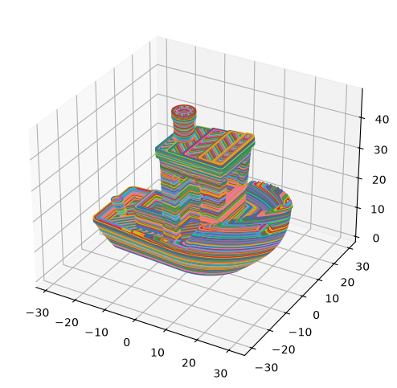
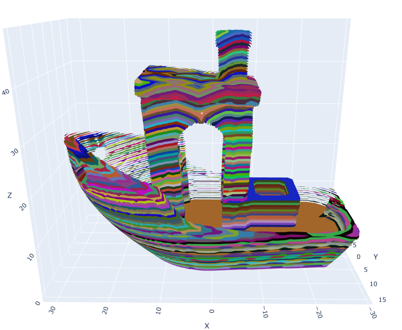
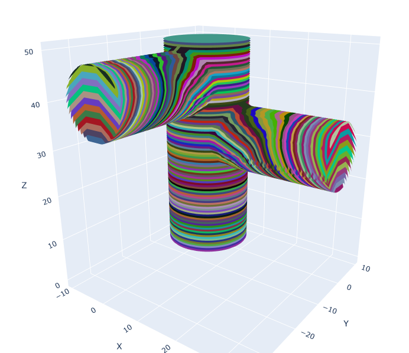
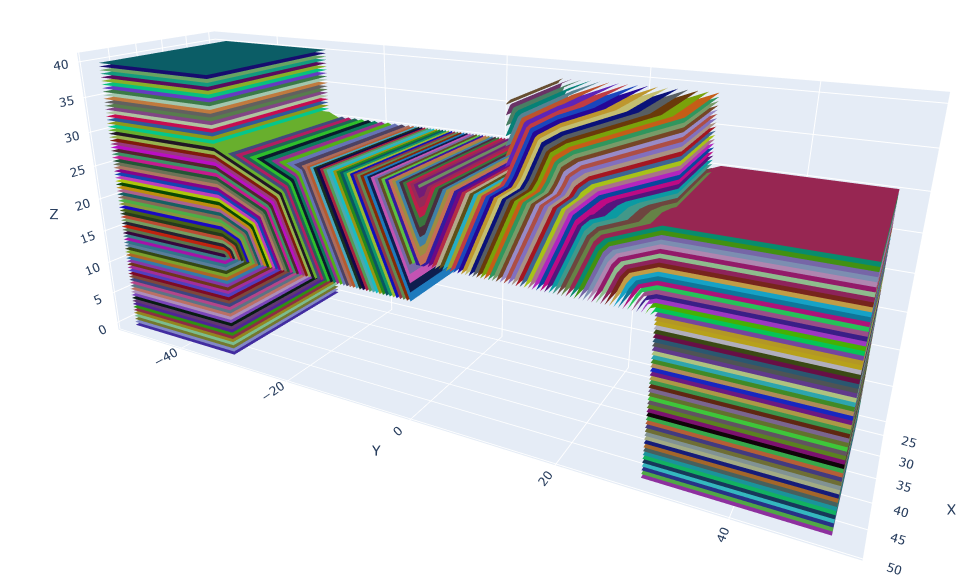
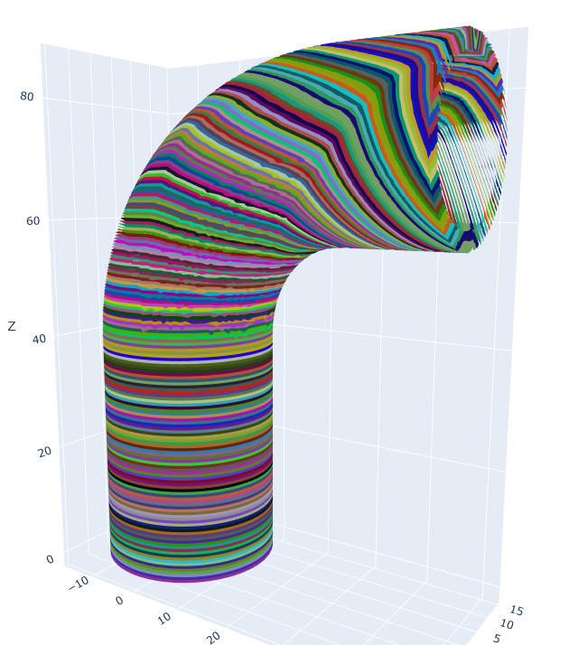

# 5-axis-3d-printer
Development a usable 5-axis slicer to improve the strength, model complexity, and surface finish of FDM parts

## Current progress

Basic 3-axis slicer. This generates the walls, top and bottom surface, and infill paterns. 

And then 5-axis slice profile generation using a wavefront propagating from the build plate. 

